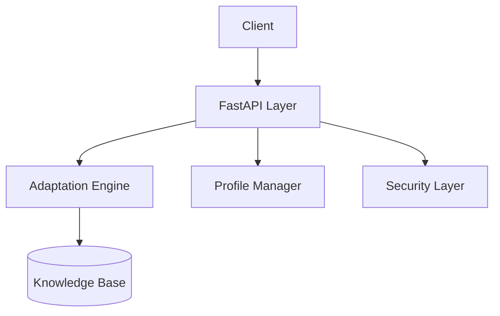

# NAM API Specification

NAM предоставл€ет REST API дл€ адаптации терминов, управлени€ профил€ми и проверки безопасности.
API построен на FastAPI и полностью совместим с MindForge, UAG, OSINT и KM-6.

---

# ?? Base URL

```
http://localhost:8000
```

---

# ?? 1. POST /resolve/term
даптаци€ одного термина.

### Request
```json
{
  "profile": "industrial",
  "term": "knowledge_core"
}
```

### Response
```json
{
  "resolved": "Industrial Knowledge Hub",
  "source": "profile: industrial",
  "status": "ok"
}
```

---

# ?? 2. POST /resolve/all
даптаци€ набора терминов под один профиль.

### Request
```json
{
  "profile": "government",
  "terms": ["knowledge_core", "km6_engine", "security_layer"]
}
```

### Response
```json
{
  "knowledge_core": "State Knowledge Core",
  "km6_engine": "Regulatory Decision Engine",
  "security_layer": "Critical Security Layer"
}
```

---

# ?? 3. GET /profiles/list
олучение списка доступных профилей.

### Response
```json
{
  "profiles": [
    "default",
    "industrial",
    "government",
    "finance",
    "healthcare",
    "military"
  ]
}
```

---

# ?? 4. POST /profile/set
”становка активного профил€ дл€ всех последующих операций.

### Request
```json
{
  "profile": "finance"
}
```

### Response
```json
{
  "status": "ok",
  "active_profile": "finance"
}
```

---

# ?? 5. POST /validate/alias
роверка корректности нового термина относительно базового системного ID.

### Request
```json
{
  "term": "Secure Intelligence Core",
  "base": "knowledge_core"
}
```

### Response
```json
{
  "valid": true,
  "score": 0.94,
  "notes": "Term is consistent with domain style."
}
```

---

# ?? 6. POST /security/check
роверка безопасности термина в контексте внутренних/внешних контуров.

### Request
```json
{
  "term": "Knowledge Kernel",
  "context": "external"
}
```

### Response
```json
{
  "allowed": true,
  "contour": "external",
  "notes": []
}
```

---

# ?? 7. шибки API
писание стандартных ошибок API.

### 400 Ч Bad Request
еверный формат входных данных.

### 404 Ч Not Found
“ермин или профиль не найдены.

### 409 Ч Conflict
оллизи€ терминов в профиле.

### 500 Ч Internal Error
шибка движка адаптации.

---

# ?? API Architecture Diagram



---

# ?? Notes
Х се ответы в формате JSON.
Х алидаци€ проводитс€ через Pydantic.
Х Swagger UI: http://localhost:8000/docs

# ?? Notes
Х се ответы в формате JSON.
Х алидаци€ проводитс€ через Pydantic.
Х Swagger UI: http://localhost:8000/docs

